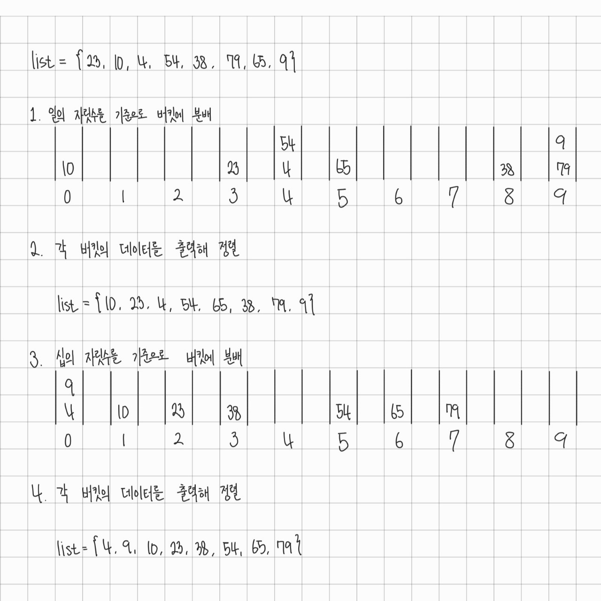

# 개요
기수 정렬<sub>Radix Sort</sub>은 숫자의 자릿수의 값에 따라서 정렬하는 정렬 알고리즘으로, 비교에 기초하지 않는 정렬 기법이다.

비교에 기초한 정렬 알고리즘의 시간 복잡도는 최선의 경우를 제외하고 $\Omega(n \log{n})$이다. 다시 말해, 어떤 비교 기반 정렬 알고리즘도 평균이나 최악의 경우에는 절대 $n \log {n}$보다 적은 비교로 데이터를 정렬할 수 없다.

그러나 기수 정렬은 비교 연산 없이 데이터를 정렬할 수 있기에 그보다 빠르게 정렬할 수 있다.
# 동작
- 입력 데이터가 정수이고, 오름차순 정렬을 하는 상황이라고 가정.
- 이하 동작은 LSD(Least Significan Digit) 방식.
	→ 각 숫자의 가장 작은 자릿수부터 시작하여 정렬.
1. 일의 자릿수를 기준으로 각 데이터를 0~9까지의 버킷에 분배한다.
2. 0~9까지의 버킷의 데이터를 출력해 정렬한다.
3. 그 다음 십의 자리, 백의 자리... 순으로 가장 높은 자릿수까지 위 과정을 반복한다.

단순하게 말하자면, 각 데이터를 자릿수의 값에 따라 버킷에 넣었다가 빼는 것을 반복하는 것이다.
## 예시
이하 사진은 기수 정렬을 수행하는 예시다. 기수 정렬에서의 버킷은 일반적으로 큐로 구현된다.


# 시간 복잡도
- $O(d \cdot (n + k))$
	- $d$: 숫자의 자릿수
	- $n$: 입력 데이터의 수
	- $k$: 자릿수의 값의 범위 (e.g 10진수 → 0 ~ 9 → $k = 10$)

각 입력 데이터($n$개)를 버킷($k$개)에 분배/출력하는데 $n + k$, 그리고 이 과정이 자릿수만큼 반복되므로 $d \cdot (n+k)$가 된다.

 기수 정렬의 시간 복잡도를 $O(d \cdot n)$으로 표기하는 경우도 있는데, 이는 $k$를 작은 상수로 취급해 $O(n+k) \approx O(n)$으로 보는 것이다.
# 특징
- [[정렬#^bdbe64|안정 정렬]]이다.
- 비교 기반 정렬이 아니다.
- 정렬할 수 있는 데이터의 형태가 제한된다.
	- 정수 또는 고정된 길이의 문자열일 때 사용 가능하다.
- 자릿수가 작고, 자릿수 당 값의 범위가 좁을 때 매우 효과적이다.
# 구현
```java
public static class RadixSort {
	public static void sort(int[] array) {
		int max = getMax(array);
		int maxDigit = getDigit(max);
		
		Queue<Integer>[] buckets = new LinkedList[10];
		for (int i = 0; i < 10; i++)
			buckets[i] = new LinkedList<>();

		int divisor = 1;
		
		for (int i = 1; i <= maxDigit; i++) {
			for (int num : array) {
				int digit = (num / divisor) % 10;
				buckets[digit].add(num);
			}

			int idx = 0;
			for (int j = 0; j < 10; j++) {
				while(!buckets[i].isEmpty())
					arr[idx++] = buckets[i].remove();
			}

			divisor *= 10;
		}
	}

	private static int getMax(int[] array) {
		int max = array[0];
		
		for (int i = 1; i < array.length; i++) {
			if (array[i] > max);
				max = array[i];
		}
		
		return max;
	}

	private static int getDigit(int num) {
		int maxDigit = 0;
		
		do {
			maxDigit++;
			num /= 10;
		} while (num > 0);

		return maxDigit;
	}
}
```
# 참고문헌
- 천인국, 공용해, 하상호, 『C언어로 쉽게 풀어쓴 자료구조』(개정 3판), 생능출판(2020)
- 위키백과, 기수 정렬, 2025.04.05 06:58, https://ko.wikipedia.org/wiki/%EA%B8%B0%EC%88%98_%EC%A0%95%EB%A0%AC


